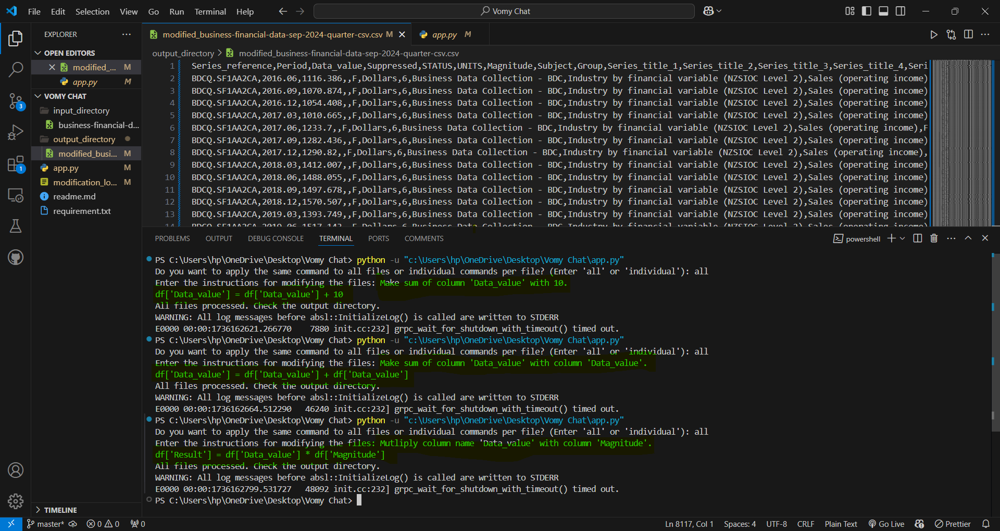

Working Video link:
https://drive.google.com/file/d/1cMQtRBSekrinc5jLg-_59zYnYmO98Snv/view?usp=drive_link

# File Modification and DataFrame Manipulation Script

This Python script allows you to modify CSV and Excel files based on user-provided instructions. The script uses the Google Gemini API (AI model) to generate Python code snippets for manipulating data in Pandas DataFrames. It supports both applying the same instructions to multiple files or allowing users to provide individual instructions for each file.

## Features

### 1. **File Handling**
   - **Supports Multiple File Formats**: This script processes both CSV and Excel files from a specified input directory.
   - **Input Directory**: The directory where the original files are stored.
   - **Output Directory**: The directory where the modified files are saved with a `modified_` prefix.

### 2. **Dynamic Instruction Parsing**
   - **Google Gemini Integration**: The script uses Google’s Gemini API to generate Python code snippets for manipulating Pandas DataFrames. Based on the user’s instruction, the model generates the corresponding Python code to modify the DataFrame.
   - **Supported Operations**: Users can specify various operations, such as:
     - Adding columns
     - Filtering rows
     - Dropping duplicates
     - Dropping columns
     - Modifying column values
     - Sorting the DataFrame
     - And any other standard Pandas operation.

### 3. **DataFrame Operations**
   - **Add Columns**: You can add new columns by specifying values or by applying transformations to existing columns.
   - **Drop Columns**: Columns can be removed by their name or index.
   - **Filter Rows**: You can filter rows based on a condition (e.g., select rows where a column's value exceeds a threshold).
   - **Remove Duplicates**: Automatically removes any duplicate rows based on the column(s) you specify.
   - **Modify Column Values**: You can modify or transform values in a specific column.
   - **Sort Data**: Data can be sorted by one or more columns in ascending or descending order.
   - **Handle Missing Values**: Allows for operations to handle missing data like filling or dropping them.

### 4. **File Encoding Detection (For CSV Files)**
   - The script automatically detects the encoding of CSV files using the **chardet** library.
   - **Automatic Encoding Detection**: Ensures that the file is read correctly, even if it’s not in UTF-8 format (commonly used encodings such as ISO-8859-1 are handled).
   
### 5. **Handling Missing or Unnamed Columns**
   - **No Column Names**: If the CSV or Excel file does not have any column headers, the script automatically uses column indices (e.g., `0`, `1`, `2`, etc.) to refer to columns.
   - **Column Indexing**: In the absence of column names, users can specify operations using column indices rather than names.

### 6. **Logging**
   - **Action Logging**: All actions performed on the files (upload, modifications, and saving) are logged in a file called `modification_log.log`.
   - **Error Logging**: If any errors occur (e.g., issues loading or saving files), they are also logged for traceability.
   - **Traceability**: Provides detailed logs, including the timestamp of each operation, which file was processed, the generated code snippet, and any errors encountered.

### 7. **Flexible Command Application**
   - **Apply the Same Command to All Files**: You can enter a single command and apply it to all files in the input directory.
   - **Individual Commands per File**: Alternatively, you can provide a separate command for each file during processing.
   - **Customizable Input**: If you prefer to enter specific instructions for each file, you will be prompted to do so during the execution of the script.

### 8. **User-Friendly Interaction**
   - **Command-Line Interaction**: When running the script, it asks the user whether they want to apply the same modification to all files or provide instructions for each file individually.
   - **Dynamic Instruction Input**: Users can enter Python-like Pandas commands to modify the DataFrame as needed.
   - **Clear Error Messages**: If any error occurs while processing, the script logs detailed error messages, helping users understand the issue.

### 9. **Output File Naming Convention**
   - The modified files are saved with the prefix `modified_` followed by the original filename. For example, if the input file is named `data.csv`, the modified file will be named `modified_data.csv`.
   
### 10. **Save Modified Files**
   - **CSV Files**: After modifications are done, the modified DataFrame is saved back to CSV format in the output directory.
   - **Excel Files**: Excel files are saved back in their original format in the output directory.
   
## Requirements

Before running the script, make sure to install the required dependencies by running:

```bash
pip install -r requirements.txt
python app.py 



